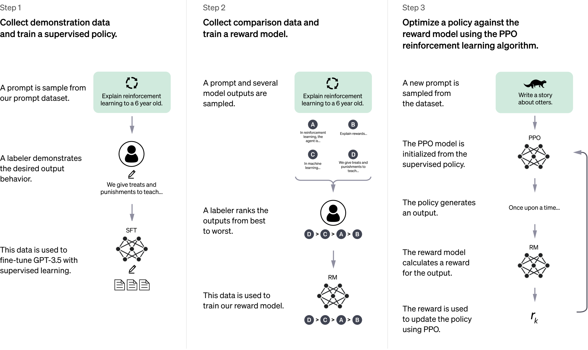

<!-- _class: title -->
# 2025/02/20 회의 (RL 관련 공유)
Wise
AI Lab
2025-02-20

---
<!-- _class: tinytext -->
# Contents
- Preliminaries
	- Random variables
	- Monte Carlo estimation
- Overview of RL
	- Terminologies
	- Value-based / Policy-based / Model-based RL
- Policy Optimization
	- Policy Gradient Theorem
	- REINFORCE
	- PPO
- Reinforcement Learning with LLMs
- Reinforcement Learning with Verifiable Rewards
- How to apply RL to Colorization(밑색/채색)
---

# Preliminaries
## Random variables
$X: \Omega \rightarrow E$
$(\Omega, \Sigma, P)$: 확률 공간 (Sample space $\Omega$, Event space $\Sigma$, Probability measure $P$)
(with some assumptions), we also have
### Probability density function
$\mathbb{E}_P [f(X)]:=\int_\Omega f(X(\omega))dP(\omega)=\int_E f(x)p(x)dx=:\mathbb{E}_{x\sim p(x)} [f(x)]$

> Note
> $E$ might be complex..

---
# Preliminaries
## Monte Carlo estimation
Goal: Calculate $\mathbb{E}_{x\sim p(x)} [f(x)]$ 
(Hint: [Law of Large Numbers](https://en.wikipedia.org/wiki/Law_of_large_numbers))

---
<!-- _class: tinytext -->
# Overview of RL
:::: columns
- Agent
- Environment
- $\mathcal{S}$: a finite set of states (상태 집합)
- $\mathcal{A}$: a finite set of actions (행동 집합)
- Policy $\pi: \mathcal{A}\times \mathcal{S}\rightarrow [0,1]$
	- Optimal policy
		- $\pi^* = \arg \max_{\pi} \mathbb{E}_{s_0\sim p_0 (s)} [V_\pi (s_0) ]$
		- $V_{\pi^*} (s) \geq V_{\pi} (s) \ (\forall x\in \mathcal{S}, \forall \pi)$
- Reward $R:\mathcal{A}\times \mathcal{S}\rightarrow \mathbb{R}$
- Value function $V:\mathcal{S}\rightarrow \mathbb{R}$
- Q-function $Q:\mathcal{S}\times \mathcal{A}\rightarrow \mathbb{R}$ 

   

::::

---
# Overview of RL
:::: columns
tiny
:::: split
wow asdfadfasdf
::::

---
# Overview of RL
## Terminologies
- Advantage function $A:\mathcal{S}\times \mathcal{A}\rightarrow \mathbb{R}$
	- $A(s,a):=Q(s,a)-V(s)$
- Generalized advantage estimation (GAE)
	- Advantage function을 계산하려면 state와 action 값이 필요하다.
	- 그런데 이러한 state, action은 (policy와 initial state의 확률분포에 depend하는) random variable이다.
	- 따라서 Advantage function의 evaluation 결과 $A(s,a)$도 random variable
	- 이 random variable을 estimate하기 위해 $R, V$를 통해 Monte Carlo estimate을 하는데 그 estimation의 variance를 줄이기 위해 나온 방법이 GAE

---
# Overview of RL
## GAE

---
# Overview of RL
## GAE

---
# Overview of RL
## Objective function of RL

$$L(\theta) = \mathbb{E}_{s_0\sim p_0 (s)}[V_{\pi_\theta}(s_0)]$$
- policy를 neural network의 parameter $\theta$를 도입하여 위의 목적함수를 최대화하도록 훈련해서 optimal policy를 얻고자 하는 것이 RL의 목표

---
<!-- _class: tinytext -->
# Overview of RL
- Value-based RL
	- Q functiond을 학습하여 $\pi(s) = \arg \max_{a\in \mathcal{A}} Q(s,a)$를 policy로 사용
	- 단점
		- function approximation (such as neural networks)
		- bootstrapped value function estimation (TD-like method)
		- off-policy learning
		- This combination : `the deadly triad`
		- RL 알고리즘 불안정함
- Policy-based RL
	- Policy search method
	- 대부분 policy gradient 방법론 사용
- Model-based RL (MBRL)

--- 
# Overview of RL
## Classification of RL

---
# Policy Optimization
## Policy Gradient Theorem

---

# Policy Optimization
## REINFORCE
- Monte Carlo version

- 단점: estimation $G_t$의 분산이 큼 
	- 해결책: baseline을 사용

---
# Policy Optimization
- PPO

---
# Reinforcement Learning with LLMs
- InstructGPT

---
# RL with LLMs
- ChatGPT

---
# RL with LLMs

---
# RL with LLMs
- DeepSeek-R1-Zero
	- RL on the Base Model

---
# Reinforcement Learning with Verifiable Rewards
## RLVR

---
# RLVR
- Tulu 3
