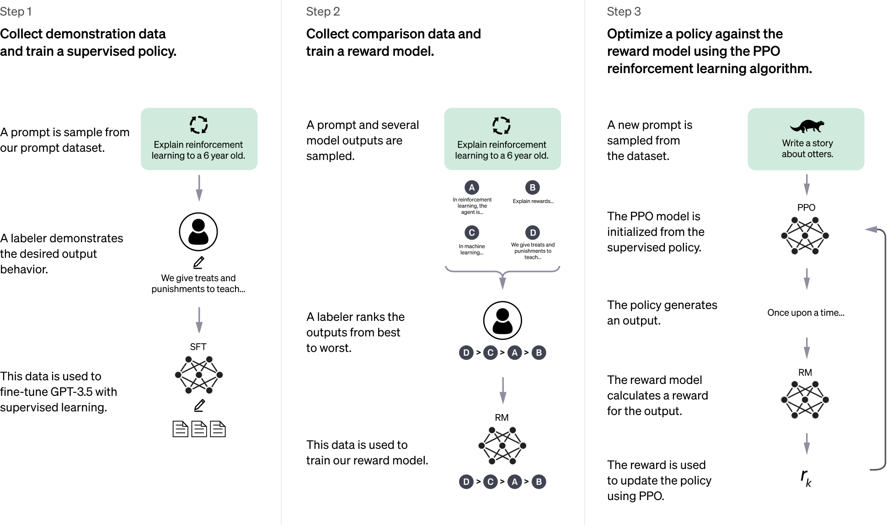

<!-- _class: title -->
# Diffusion Meets Flow Matching:
Wise
AI Lab
2025-05-20

---
<!-- _class: tinytext -->
# Contents
- Mathematical preliminaries
	- Integration
	- ODE vs SDE
	- ODE sampler
	- SDE sampler
- Diffusion models and Flow matching
	- Diffusion models
	- Value-based / Policy-based / Model-based RL
- Sampling
	- DDIM sampling
	- Flow matching sampling
	- Probability Flow ODE sampling

---
<!-- _class: tinytext -->
# Mathematical preliminaries
## Integration (in $\mathbb{R}$ and $\mathbb{R}^n$)
### Riemann Integral

### Riemann-Stieltjes Integral
- Bounded variation and Riemann-Stieltjes Sum
$$
BV(f,[a,b]) := \sup_{P} \bigg( \sum_{i=1}^n \Big|f(x_i)-f(x_{i-1})\Big| \bigg)
$$
$$
S(f,P,g) := \sum_{i=1}^{n} f(x_i^*) (g(x_i)-g(x_{i-1}))
$$

---
# Preliminaries
## Integration on manifolds

Goal: Calculate $\mathbb{E}_{x\sim p(x)} [f(x)]$ 
(Hint: [Law of Large Numbers](https://en.wikipedia.org/wiki/Law_of_large_numbers))

---
# Pre
## Manifolds
> Note (Wikipedia - Manifold)

---
# Pre
## Manifolds

---
# Preliminaries
## Integration on manifolds

$$
\int_{U \subset \mathcal{M}} \omega = \int_{\varphi(U)} (\varphi^{-1})^* \omega
$$

---
<!-- _class: tinytext -->
# Overview of RL

   
- Agent
- Environment
- $\mathcal{S}$: a finite set of states (상태 집합)
- $\mathcal{A}$: a finite set of actions (행동 집합)
- Policy $\pi: \mathcal{A}\times \mathcal{S}\rightarrow [0,1]$
	- Optimal policy
		- $\pi^* = \arg \max_{\pi} \mathbb{E}_{s_0\sim p_0 (s)} [V_\pi (s_0) ]$
		- $V_{\pi^*} (s) \geq V_{\pi} (s) \ (\forall x\in \mathcal{S}, \forall \pi)$
- Reward $R:\mathcal{A}\times \mathcal{S}\rightarrow \mathbb{R}$
- Value function $V:\mathcal{S}\rightarrow \mathbb{R}$
- Q-function $Q:\mathcal{S}\times \mathcal{A}\rightarrow \mathbb{R}$ 

   

---
# Overview of RL

- test
- wow
- great
- gg
- wownae

wow

---

---
# Overview of RL
## GAE

---
# Overview of RL
## Objective function of RL

$$L(\theta) = \mathbb{E}_{s_0\sim p_0 (s)}[V_{\pi_\theta}(s_0)]$$
- policy를 neural network의 parameter $\theta$를 도입하여 위의 목적함수를 최대화하도록 훈련해서 optimal policy를 얻고자 하는 것이 RL의 목표

---
<!-- _class: tinytext -->
# Overview of RL
- Value-based RL
	- Q functiond을 학습하여 $\pi(s) = \arg \max_{a\in \mathcal{A}} Q(s,a)$를 policy로 사용
	- 단점
		- function approximation (such as neural networks)
		- bootstrapped value function estimation (TD-like method)
		- off-policy learning
		- This combination : `the deadly triad`
		- RL 알고리즘 불안정함
- Policy-based RL
	- Policy search method
	- 대부분 policy gradient 방법론 사용
- Model-based RL (MBRL)

---
# Reinforcement Learning with LLMs
- InstructGPT

---
# RL with LLMs
- ChatGPT

---
# RL with LLMs

---
# RL with LLMs
- DeepSeek-R1-Zero
	- RL on the Base Model

---
# Reinforcement Learning with Verifiable Rewards
## RLVR

---
# RLVR
- Tulu 3
